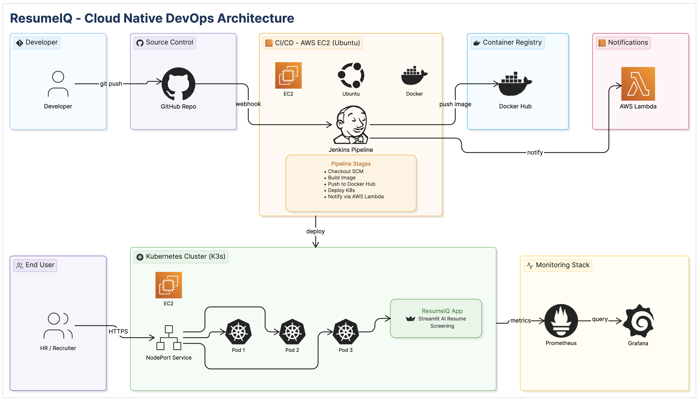
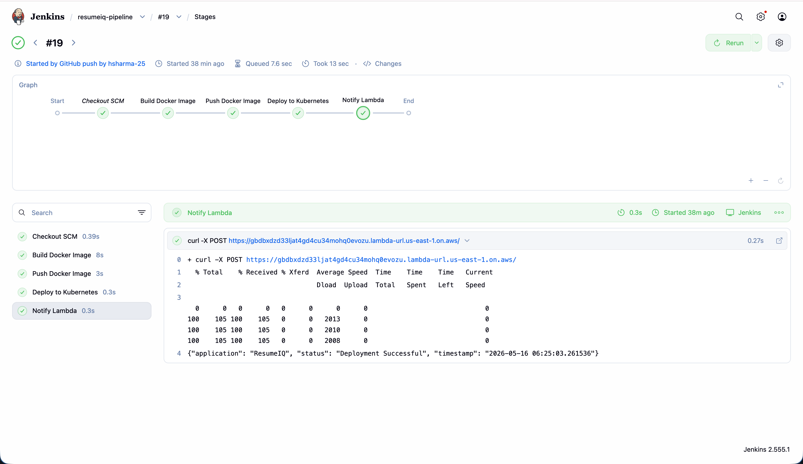
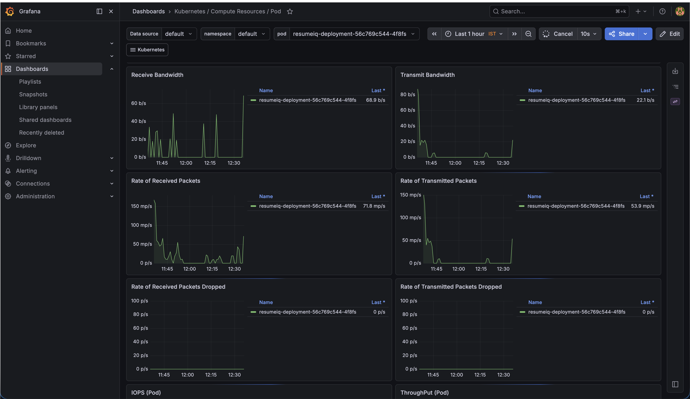
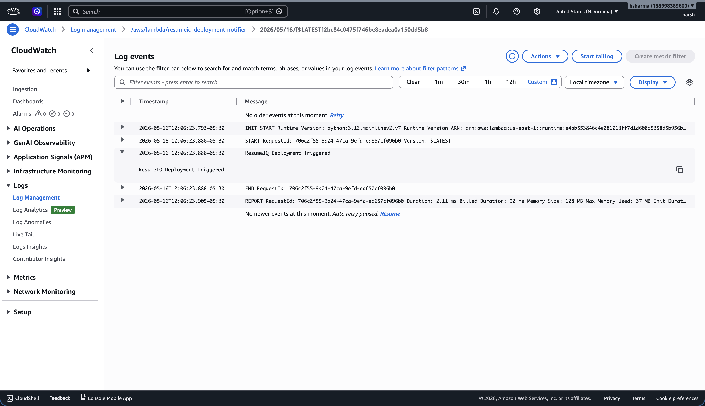

# Cloud-Native AI Resume Screening System


The project follows a **cloud-native DevOps architecture** where application changes pushed to GitHub automatically trigger a **Jenkins CI/CD** pipeline through **GitHub Webhooks**.

The pipeline performs:

- Source code checkout
- Docker image build
- Docker image push to Docker Hub
- Kubernetes deployment update
- AWS Lambda deployment notification

The ResumeIQ application is deployed on a **Kubernetes (K3s)** cluster hosted on **AWS EC2**, while **Prometheus** and **Grafana** provide monitoring and observability for the infrastructure and application workloads.  

## Project Highlights

- AI-powered semantic resume screening system
- Fully automated CI/CD pipeline using Jenkins
- Docker-based containerized deployment
- Kubernetes orchestration using K3s
- Infrastructure provisioning using Terraform
- Monitoring and observability using Prometheus and Grafana
- Event-driven AWS Lambda integration
- GitHub webhook automation
- Cloud-native deployment on AWS EC2

<!-- `The site is [live](http://13.223.250.12:30007)` -->

Below, follows a step by step implementation guide for the same with each command and its purpose explained.  

Happy Learning :)

---

## Contents
- [System Architecture](#system-architecture)
- [Phase 1: Docker](#phase-1-docker)  
    - [Step 1: The Dockerfile and .dockerignore](#step-1-the-dockerfile-and-dockerignore)  
    - [Step 2: Building the Docker image](#step-2-building-the-docker-image)
    - [Step 3: Running the Docker container](#step-3-running-the-docker-container)
    - [Step 4: Accessing the application](#step-4-accessing-the-application)
- [Phase 2: EC2 Deployment + Containerization](#phase-2-ec2-deployment--containerization)
    - [Step 1: Creating and launching the EC2 instance](#step-1-creating-and-launching-the-ec2-instance)
    - [Step 2: Connecting to EC2 instance(SSH)](#step-2-connecting-to-ec2-instance-ssh)
    - [Step 3: Installing git and cloning the repo into the instance](#step-3-installing-git-and-cloning-the-repo-into-the-instance)
    - [Step 4: Installing Docker and Containerization](#step-4-installing-docker-and-containerization)
- [Phase 3: Jenkins Installation + Jenkins pipeline construction + Docker Hub integration](#phase-3-jenkins-installation--jenkins-pipeline-construction--docker-hub-integration)
    - [Step 1: Install Java and add Jenkins repository](#step-1-install-java-and-add-jenkins-repository)
    - [Step 2: Install Jenkins](#step-2-install-jenkins)
    - [Step 3: Further Jenkins setup through Jenkins UI](#step-3-further-jenkins-setup-through-jenkins-ui)
    - [Step 4: Creating Jenkins pipeline](#step-4-creating-jenkins-pipeline)
    - [Step 5: Integrating Docker Hub](#step-5-integrating-docker-hub)
- [Phase 4: Kubernetes Orchestration](#phase-4-kubernetes-orchestration)
    - [Step 1: Install K3s](#step-1-install-k3s)
    - [Step 2: Creating deployment.yml file](#step-2-creating-deploymentyml-file)
    - [Step 3: Kubernetes service](#step-3-kubernetes-service)
    - [Step 4: Deploy kubernetes resources](#step-4-deploy-kubernetes-resources)
    - [Step 5: Jenkins and Kubernetes integration](#step-5-jenkins-and-kubernetes-integration)
- [Phase 5: Infrastructure as Code using Terraform](#phase-5-infrastructure-as-code-using-terraform)
    - [Step 1: Install Terraform](#step-1-install-terraform)
    - [Step 2: Create Terraform configuration](#step-2-create-terraform-configuration)
    - [Step 3: Initialize, Validate, Provision Infrastructure](#step-3-initialize-validate-provision-infrastructure)
- [Phase 6: Monitoring and Visualization with Prometheus and Grafana](#phase-6-monitoring-and-visualization-with-prometheus-and-grafana)
    - [Step 1: Install Helm](#step-1-install-helm)
    - [Step 2: Install kube-prometheus-stack](#step-2-install-kube-prometheus-stack)
    - [Step 3: Expose Grafana using NodePort](#step-3-expose-grafana-using-nodeport)
    - [Step 4: Access Grafana dashboard](#step-4-access-grafana-dashboard)
- [Phase 7: Automated CI/CD using GitHub Webhooks and Jenkins](#phase-7-automated-cicd-using-github-webhooks-and-jenkins)
    - [Step 1: Configure Jenkins](#step-1-configure-jenkins)
    - [Step 2: Configure GitHub](#step-2-configure-github)
    - [Step 3: Test pipeline](#step-3-test-pipeline)
- [Phase 8: AWS Lambda Notifier Integration](#phase-8-aws-lambda-notifier-integration)
    - [Step 1: Create Lambda Function](#step-1-create-lambda-function)
    - [Step 2: Write function code](#step-2-write-function-code)
    - [Step 3: Create Lambda function URL](#step-3-create-lambda-function-url)
    - [Step 4: Integrate Lambda with Jenkins pipeline](#step-4-integrate-lambda-with-jenkins-pipeline)
    - [Step 5: Verify Lambda execution](#step-5-verify-lambda-execution)

---

## System Architecture


### Tech Stack
| Layer            | Technology          |
| ---------------- | ------------------- |
| Source Control   | GitHub              |
| CI/CD            | Jenkins             |
| Containerization | Docker              |
| Registry         | Docker Hub          |
| Orchestration    | Kubernetes (K3s)    |
| IaC              | Terraform           |
| Monitoring       | Prometheus, Grafana |
| Notifications    | AWS Lambda          |
| Cloud            | AWS EC2             |

---

## Phase 1: Docker
### Docker helps in containerizing an application which ensures that the application runs consistently across different environments such as local machines, cloud servers, CI/CD pipelines, and Kubernetes clusters.
### In this step we write the Dockerfile, .dockerignore file, build the image from the Dockerfile and run our container off of the built image

#### Step 1: The Dockerfile and .dockerignore
- Before building the image we need to define all the instructions Docker would follow while building the image. 
- These instructions are defined in the Dockerfile. A Docker file executes instructions, copies various files etc.. 
- To ensure no unnecessary files are copied a .dockerignore file is created  
Example:
```dockerignore
__pycache__/
.venv/
.git/
.env
.ipynb_checkpoints/
```
- Next we write the Dockerfile 
```Dockerfile
FROM python:3.11-slim

WORKDIR /app

COPY requirements.txt .

RUN pip install --no-cache-dir \
    --extra-index-url https://download.pytorch.org/whl/cpu \
    -r requirements.txt

COPY . .

EXPOSE 8501

CMD ["streamlit", "run", "app/main.py", "--server.address=0.0.0.0"]
```

#### Step 2: Building the Docker image
- The Docker image is built using the following command
```bash
docker build -t resumeiq .
```
- "docker build" creates the image
- "-t resumeiq" assigns the image name
- "." specifies the current directory as build context

#### Step 3: Running the Docker container
- The Docker container was started using
```bash
docker run -d -p 8501:8501 resumeiq
```
- The "-d" makes the container run in detached mode
- The "-p" field allows the application to be accessed on the specified port
- By default, Streamlit uses port no. "8501"

#### Step 4: Accessing the application
- The application is now containerized
- The application can be accessed on localhost port 8501
```
http://localhost:8501
```

---

## Phase 2: EC2 Deployment + Containerization
### The objective of this phase is to deploy our application onto an EC2 instance so that it can be run on the cloud. We'll deploy the containerized version of our application. 
#### Step 1: Creating and launching the EC2 instance
- An EC2 instance is just a virtual machine running on the cloud
- This step involves starting and launching the ec2 instance for our application
- We proceed by providing the required permissions and resources to the instance  

EC2 configuration used:  
| Setting      | Value        |
|:-------------|:-------------|
| Instance type | m7i-flex.large     |
| Storage      | 50GB gp3     |
| OS           | Ubuntu       |
| Authentication | SSH key pair |  
  

Security group configuration:
| Port      | Purpose        |
|:-------------|:-------------|
| 22 | SSH     |
| 8080      | Jenkins     |
| 8501           | Streamlit|  
  

#### Step 2: Connecting to EC2 instance (SSH)
- Use SSH to securely connect to EC2 instance  


Command:
```bash
ssh -i <key.pem> ubuntu@<EC2-PUBLIC-IP>
```

- Before installing anything, update packages  


Command:
```bash
sudo apt update && sudo apt upgrade -y
```
#### Step 3: Installing git and cloning the repo into the instance
#### Install git to enable repository cloning and version control operations.
- Install git
```
sudo apt install git -y 
```
- Clone the repo
```
git clone https://github.com/hsharma-25/Cloud-Native-AI-Resume-Screening-System.git
```

#### Step 4: Installing Docker and Containerization
#### Docker helps us in containerizing an application. Containerization packages the application with its dependencies into isolated containers. This ensures that the application runs same everywhere and on evey device. 
- Install Docker on EC2 instance
```bash
sudo apt install docker.io -y
```

- Start and enable Docker using the following commands
- These commands start Docker and ensure Docker restarts on reboot
```bash
sudo systemctl start docker
sudo systemctl enable docker
```

- Docker requires sudo access
- Allow normal users to run Docker commands
```bash
sudo usermod -aG docker ubuntu
```
- Apply changes
```bash
newgrp docker
```

- Now create the Dockerfile
- Use the same Dockerfile we created intially 
```Dockerfile
FROM python:3.11-slim

WORKDIR /app

COPY requirements.txt .

RUN pip install --no-cache-dir \
    --extra-index-url https://download.pytorch.org/whl/cpu \
    -r requirements.txt

COPY . .

EXPOSE 8501

CMD ["streamlit", "run", "app/main.py", "--server.address=0.0.0.0"]
```
Dockerfile explanation:
| Instruction | Purpose                          |
| ----------- | -------------------------------- |
| FROM        | Base Python image                |
| WORKDIR     | Sets container working directory |
| COPY        | Copies project files             |
| RUN         | Installs dependencies            |
| EXPOSE      | Exposes Streamlit port           |
| CMD         | Starts application               |


An extra index was used:
```bash
--extra-index-url https://download.pytorch.org/whl/cpu
```
The purpose:
- Installs CPU-only PyTorch
- Avoids unnecessary CUDA/GPU libraries
- Reduces image size
- Speeds up CI/CD builds

The .dockerignore file:
- Use the same .dockerignore file from earlier
- Helps reduces Docker build context size
- Pevents unnecessary files from entering image

Building the Docker image and running the Docker container
- Use the same commands we used for local containerization
```bash
docker build -t resumeiq .
```
```bash
docker run -d --name resumeiq-container -p 8501:8501 resumeiq
```
To access the application which is now running on the EC2 instance  
Type in browser:
```
http://<EC2-IP>:8501
```

#### Now our application is containerized and deployed on cloud using an EC2 instance. Cool :)

---

## Phase 3: Jenkins Installation + Jenkins pipeline construction + Docker Hub integration
### Jenkins is an automation server used  for CI/CD pipelines, automated build and deployments.
#### Step 1: Install Java and add Jenkins repository
#### Java runtime is required for running Jenkins. 
- Install Java
```bash
sudo apt install openjdk-21-jdk -y
```
- Add Jenkins GPG key
```bash
curl -fsSL https://pkg.jenkins.io/debian-stable/jenkins.io-2026.key | sudo tee \
  /usr/share/keyrings/jenkins-keyring.asc > /dev/null
```
Why?
- Ubuntu verifies packages before installing them.
- This key proves:
    - the package is really from Jenkins
    - it hasn’t been tampered with
- Without this key:
    - apt will not trust the Jenkins packages.

- Add Jenkins repository
```bash
echo deb [signed-by=/usr/share/keyrings/jenkins-keyring.asc] \
  https://pkg.jenkins.io/debian-stable binary/ | sudo tee \
  /etc/apt/sources.list.d/jenkins.list > /dev/null
```
Why?
- By default, Ubuntu repositories do not contain the latest Jenkins version.
- After adding this repository, apt knows:
    - where to download Jenkins from
    - where to check for future updates

#### Step 2: Install Jenkins
- Update apt
```bash
sudo apt update 
```
- Install Jenkins
```bash
sudo apt install jenkins -y
```
- Start and enable jenkins
```bash
sudo systemctl start jenkins
sudo systemctl enable jenkins
```

#### Step 3: Further Jenkins setup through Jenkins UI
- Access Jenkins through browser
```bash
http://<EC2-IP>:8080
```
- Retrieve initial admin password
```bash
sudo cat /var/lib/jenkins/secrets/initialAdminPassword
```
- On next step, click on intall suggested plug-ins
- Jenkins will install all required plug-ins by itself
Jenkins-Docker integration
- Jenkins runs under jenkins user
- This user requires Docker permissions
```bash
sudo usermod -aG docker jenkins
```
- To apply new permissions, restart jenkins
```bash
sudo systemctl restart jenkins
```
- Verify Docker access
```bash
sudo su - jenkins
docker ps
```
- The above command verifies that Jenkins can communicate with Docker daemon

#### Step 4: Creating Jenkins pipeline
#### The new job in Jenkins was created as a pipeline. In this method, the complete pipeline is defined as code in a file called Jenkinsfile. Futher we perform SCM (Source Code Management) integration to connect the jenkins pipeline to our GitHub repo.
- Create the jenkinsfile
- Push file to repo
```groovy
pipeline {
    agent any

    stages {

        stage('Build Docker Image') {
            steps {
                sh 'docker build -t hsharma25/resumeiq:latest .'
            }
        }

        stage('Push Docker Image') {
            steps {
                sh 'docker push hsharma25/resumeiq:latest'
            }
        }

        stage('Deploy to Kubernetes') {
            steps {
                sh 'kubectl apply -f k8s/deployment.yaml'
            }
        }

        stage('Notify Lambda') {
            steps {
                sh '''
                curl -X POST https://gbdbxdzd33ljat4gd4cu34mohq0evozu.lambda-url.us-east-1.on.aws/
                '''
            }
        }
    }
}
```
Pipeline stage explanation:
| Stage                | Purpose                          |
| -------------------- | -------------------------------- |
| Build Docker Image   | Creates updated image            |
| Push Docker Image    | Uploads image to Docker Hub      |
| Deploy to Kubernetes | Updates Kubernetes deployment    |
| Notify Lambda        | Triggers deployment notification |

- Click on "Build Now" in jenkins to start the whole process
- Observe the console to see how each step is executed
- Each step previously done manually like Docker build and Docker start is automated by Jenkins now

#### Step 5: Integrating Docker Hub
#### Similar to how GitHub stores source code, Docker Hub is a container registry to store images. From now on, Jenkins will build image -> push it to Docker Hub and deployments will pull image from Docker Hub when required
- On EC2, log in to Docker hub
```bash
docker login
```
- Build tagged image
```bash
docker build -t hsharma25/resumeiq:latest .
```
- Push image to Docker hub
```bash
docker push hsharma25/resumeiq:latest
```

### Pipeline Graph View

---

## Phase 4: Kubernetes Orchestration
### Docker alone can not handle automatic recovery, scaling, orchestration, cluster management etc.. Kubernetes solves this by managing containers, deployments, networking, self-healing and scaling. This phase focuses on installing Kubernetes, defining deployment and service manifests and integrating K8s with the Jenkins pipeline

#### Step 1: Install K3s
#### We'll continue by integrating Kubernetes through K3s. Other methods like using minikube could have been used, but K3s proves to be a better option sice it provides lower RAM usage, lower CPU overhead, and fewer operational issues. 
- Stop and remove current running container
```bash
docker stop resumeiq-container
docker rm resumeiq-container
```
- Install K3s
```bash
curl -sfL https://get.k3s.io | sh -
```
K3s installs:
- Kubernetes API server
- scheduler
- kubelet
- container runtime
- networking
- kubectl  
  
Verify K3s service
```bash
sudo systemctl status k3s
```
Verify Kubernetes nodes
```bash
sudo kubectl get nodes
```
Purpose:
- verifies cluster node readiness
- confirms Kubernetes control plane functionality  

#### Step 2: Creating deployment.yml file
#### Kubernetes uses declarative infrastructure instead of manually running containers. The desired infrastructure state is defined through YAML manifests, particularly the deployment.yaml file. Kubernetes continuously ensures actual system state matches declared state.

- Create the deployment.yaml file 
```yml
apiVersion: apps/v1
kind: Deployment

metadata:
  name: resumeiq-deployment

spec:
  replicas: 3

  selector:
    matchLabels:
      app: resumeiq

  template:
    metadata:
      labels:
        app: resumeiq

    spec:
      containers:
      - name: resumeiq-container
        image: hsharma25/resumeiq:latest

        imagePullPolicy: Always

        ports:
        - containerPort: 8501
```
Explanation:
| Field           | Purpose                     |
| --------------- | --------------------------- |
| apiVersion      | Kubernetes API version      |
| kind            | Type of Kubernetes resource |
| metadata        | Resource identification     |
| replicas        | Desired pod count           |
| selector        | Pod matching labels         |
| template        | Pod definition              |
| image           | Docker image source         |
| imagePullPolicy | Always fetch latest image   |
| containerPort   | Exposed application port    |

#### Step 3: Kubernetes service
#### K8s service ensures consistent networking and load balancing. All required states are defined in the service.yaml file
- Create service.yaml file
```yml
apiVersion: v1
kind: Service

metadata:
  name: resumeiq-service

spec:
  type: NodePort

  selector:
    app: resumeiq

  ports:
    - port: 8501
      targetPort: 8501
      nodePort: 30007
```
Explanation:
| Field          | Purpose                  |
| -------------- | ------------------------ |
| kind: Service  | Creates networking layer |
| type: NodePort | Exposes app externally   |
| selector       | Maps service to pods     |
| port           | Service port             |
| targetPort     | Container port           |
| nodePort       | External EC2 port        |

#### Step 4: Deploy kubernetes resources
- Apply deployment
```bash
sudo kubectl apply -f k8s/deployment.yaml
```
- Apply service
```bash
sudo kubectl apply -f k8s/service.yaml
```
- Access the application using
```
http://<ELASTIC-IP>:30007
```

#### Step 5: Jenkins and Kubernetes integration
#### We'll enable Jenkins CI/CD pipeline to communicate with Kubernetes cluster, trigger rolling deployments, automate Kubernetes re-deployment process
- Firstly, Jenkins needs ability to execute kubectl commands
- For this, we need to update the Kubernetes configuration file
- The file is stored at ```/etc/rancher/k3s/k3s.yaml```
- Copy kubernetes congig for Jenkins
```bash
sudo cp /etc/rancher/k3s/k3s.yaml /var/lib/jenkins/kubeconfig
```
- Configure KUBECONFIG environment variable
- Open ```sudo systemctl edit jenkins```  

Add:
```
[Service]
Environment="KUBECONFIG=/var/lib/jenkins/kubeconfig"
```
- "KUBECONFIG"environment variable tells kubectl which Kubernetes configuration file to use
- Without this, Jenkins cannot communicate with Kubernetes cluster.
- Reload Jenkins service
```bash
sudo systemctl daemon-reload
sudo systemctl restart jenkins
```
- Confirm Jenkins-Kubernetes integration 
```bash
sudo su - jenkins
kubectl get nodes
```
- Confirms Jenkins user can access Kubernetes cluster  

**Important**: Update the old Jenkins pipeline:
```groovy
pipeline {
    agent any

    stages {

        stage('Build Docker Image') {
            steps {
                sh 'docker build -t hsharma25/resumeiq:latest .'
            }
        }

        stage('Push Docker Image') {
            steps {
                sh 'docker push hsharma25/resumeiq:latest'
            }
        }

        stage('Deploy to Kubernetes') {
            steps {
                sh 'kubectl apply -f k8s/deployment.yaml'
            }
        }
    }
}
```
The line:
```bash
kubectl rollout restart deployment resumeiq-deployment
```
Triggers:
- old pod termination
- new pod creation
- deployment using latest Docker image

---

## Phase 5: Infrastructure as Code using Terraform
### The objective of this phase is to automate infrastructure provisioning using Terraform. Terraform enables Infrastructure-as-Code (IaC), allowing cloud infrastructure to be defined declaratively through configuration files instead of manual provisioning.

#### Step 1: Install Terraform

```bash
sudo apt update
sudo apt install -y gnupg software-properties-common
```
- Add HashiCorp GPG key
```bash
 wget -O- https://apt.releases.hashicorp.com/gpg | \
gpg --dearmor | \
sudo tee /usr/share/keyrings/hashicorp-archive-keyring.gpg
```
- Add Terraform repository
```bash
echo "deb [signed-by=/usr/share/keyrings/hashicorp-archive-keyring.gpg] \
https://apt.releases.hashicorp.com $(lsb_release -cs) main" | \
sudo tee /etc/apt/sources.list.d/hashicorp.list
```
- Install Terraform
```bash
sudo apt update
sudo apt install terraform -y
```

#### Step 2: Create Terraform configuration
#### Terraform infrastructure resources are defined inside the main.tf file.
Resources configured:
- AWS provider
- EC2 instance
- Security Group
- Storage configuration

The **main.tf** file:
```terraform
provider "aws" {
  region = "us-east-1"
}

resource "aws_security_group" "resumeiq_sg" {
  name        = "resumeiq-security-group"
  description = "Security group for ResumeIQ DevOps project"

  ingress {
    from_port   = 22
    to_port     = 22
    protocol    = "tcp"
    cidr_blocks = ["0.0.0.0/0"]
  }

  ingress {
    from_port   = 8080
    to_port     = 8080
    protocol    = "tcp"
    cidr_blocks = ["0.0.0.0/0"]
  }

  ingress {
    from_port   = 30007
    to_port     = 30007
    protocol    = "tcp"
    cidr_blocks = ["0.0.0.0/0"]
  }

  ingress {
    from_port   = 30244
    to_port     = 30244
    protocol    = "tcp"
    cidr_blocks = ["0.0.0.0/0"]
  }

  ingress {
    from_port   = 8501
    to_port     = 8501
    protocol    = "tcp"
    cidr_blocks = ["0.0.0.0/0"]
  }

  egress {
    from_port   = 0
    to_port     = 0
    protocol    = "-1"
    cidr_blocks = ["0.0.0.0/0"]
  }
}

resource "aws_instance" "resumeiq_server" {
  ami           = "ami-0c02fb55956c7d316"
  instance_type = "m7i-flex.large"

  root_block_device {
    volume_size = 50
    volume_type = "gp3"
  }

  vpc_security_group_ids = [aws_security_group.resumeiq_sg.id]

  tags = {
    Name = "ResumeIQ-DevOps-Server"
  }
}
```

#### Step 3: Initialize, Validate, Provision Infrastructure

- Intialize terraform
```bash
terraform init
```
- Validate infrastructure
```bash
terraform validate
```
- Preview infrastructure changes
```bash
terraform plan
```
- Provision infrastructure
- Terraform automatically provisions AWS infrastructure resources.
```bash
terraform apply
```
---

## Phase 6: Monitoring and Visualization with Prometheus and Grafana
### The objective of this phase is to implement a complete monitoring and observability stack for the ResumeIQ Kubernetes infrastructure using Prometheus, Grafana, Helm and Kubernetes monitoring exporters
#### Technologies used:
| Technology         | Purpose                    |
| ------------------ | -------------------------- |
| Prometheus         | Metrics collection         |
| Grafana            | Dashboard visualization    |
| Helm               | Kubernetes package manager |
| Node Exporter      | Node-level metrics         |
| kube-state-metrics | Kubernetes object metrics  |

#### Step 1: Install Helm
#### What is Helm?
Helm is a package manager for Kubernetes. It simplifies Kubernetes application deployment using Helm Charts. A Helm chart is a pre-configured Kubernetes application template.
```bash
curl https://raw.githubusercontent.com/helm/helm/main/scripts/get-helm-3 | bash
```
- Add Prometheus Helm repository. 
- Purpose: adds official Prometheus Helm chart repository
```bash
helm repo add prometheus-community https://prometheus-community.github.io/helm-charts
```
- Update Helm repositories
- Purpose: downloads latest Helm chart metadata
```bash
helm repo update
```

- Create monitoring namespace
- Purpose: isolates monitoring resources inside Kubernetes

What is a Kubernetes Namespace?  
Namespaces logically separate Kubernetes resources.
Examples:
- default
- kube-system
- monitoring

This improves organization and resource management.
```bash
sudo kubectl create namespace monitoring
```

#### Step 2: Install kube-prometheus-stack
- Purpose: installs complete monitoring stack

Components installed:
- Prometheus
- Grafana
- Alertmanager
- Node Exporter
- kube-state-metrics
```bash
KUBECONFIG=/etc/rancher/k3s/k3s.yaml helm install monitoring prometheus-community/kube-prometheus-stack --namespace monitoring
```

- Verify monitoring pods
- Checks monitoring stack deployment
```bash
sudo kubectl get pods -n monitoring
```

- Verify monitoring services
```bash
sudo kubectl get svc -n monitoring
```

#### Step 3: Expose Grafana using NodePort
#### Grafana is initially accessible only inside the Kubernetes cluster. To access Grafana externally, a NodePort service was created.
- Command:
```bash
sudo kubectl expose service monitoring-grafana \
  --type=NodePort \
  --target-port=3000 \
  --name=grafana-nodeport \
  -n monitoring
```

- Retrieve Grafana NodePort
- Grafana is accessible on this port
- Accordingly, add inbound rule to EC2 security group  
```bash
sudo kubectl get svc -n monitoring
```

#### Step 4: Access Grafana dashboard
- Type in browser
- Example:
```
http://<ELASTIC-IP>:30244
```

- Retrieve Grafana admin password

Grafana login credentials:  
| Field    | Value          |
| -------- | -------------- |
| Username | admin          |
| Password | command output |

```bash
sudo kubectl get secret -n monitoring monitoring-grafana \
  -o jsonpath="{.data.admin-password}" | base64 --decode
```

### Grafana Dashboard

---

## Phase 7: Automated CI/CD using GitHub Webhooks and Jenkins
### The objective of this phase is to automate the CI/CD pipeline by integrating GitHub with Jenkins using webhooks. This phase automates the workflow so that every GitHub push event automatically triggers the Jenkins pipeline without manual intervention.
#### What is a GitHub Webhook?
A webhook is an event-driven HTTP callback mechanism.

Whenever specific events occur inside a GitHub repository, GitHub automatically sends an HTTP POST request to Jenkins.

In this project:
- GitHub push event triggers Jenkins automatically
- Jenkins then executes the CI/CD pipeline

#### Step 1: Configure Jenkins
- Inside Jenkins, configure the pipeline
- Under "Build Triggers" check the option "GitHub hook trigger for GITScm polling"

#### Step 2: Configure GitHub
- Inside the respective GitHub repo
- Go to settings -> webhooks -> add webhook
- In the "Payload URL" field inside webhook configuration, add:
```
http://<ELASTIC-IP>:8080/github-webhook/
```
- For content type, select "application/json"
- In events select option: "Just the push event"

#### Step 3: Test pipeline
- Save webhook
- Push a small change to GitHub
- After pushing code:
    - GitHub automatically sends webhook request
    - Jenkins pipeline starts automatically
    - No manual “Build Now” action is required

---

## Phase 8: AWS Lambda Notifier Integration
### AWS Lambda is a serverless compute service that allows code execution without managing servers or infrastructure. 
### The objective of this phase is to integrate serverless event-driven functionality into the CI/CD pipeline using AWS Lambda. Integrate AWS Lambda to automatically trigger deployment notifications whenever the Jenkins pipeline completes successfully.

#### Step 1: Create Lambda Function
- Open AWS Console
- Navigate to: AWS Lambda -> Create function
- Select: author from scratch

Configuration used:
| Field         | Value                        |
| ------------- | ---------------------------- |
| Function Name | resumeiq-deployment-notifier |
| Runtime       | Python 3.12                  |
| Architecture  | x86_64                       |

#### Step 2: Write function code
Purpose of the Lambda function:

- Receives deployment trigger from Jenkins
- Logs deployment activity
- Returns deployment response
- Demonstrates serverless integration

Code:
```python
import json
from datetime import datetime

def lambda_handler(event, context):

    print("ResumeIQ deployment completed successfully via Jenkins CI/CD pipeline")

    response = {
        "application": "ResumeIQ",
        "status": "Deployment Successful",
        "timestamp": str(datetime.now())
    }

    return {
        'statusCode': 200,
        'body': json.dumps(response)
    }
```

#### Step 3: Create Lambda Function URL
Why Function URL?
- Lambda Function URL exposes the Lambda function through a public HTTPS endpoint.
- This allows Jenkins to invoke Lambda directly using HTTP requests.
- Inside Lambda: Configuration → Function URL → Create Function URL

Configuration used:
| Field     | Value    |
| --------- | -------- |
| Auth Type | NONE     |
| CORS      | Disabled |

#### Step 4: Integrate Lambda with Jenkins Pipeline
- Update Jenkins to trigger Lambda automatically after deployment completion.
- The following stage was added to the Jenkinsfile:

Purpose:
- Sends HTTP POST request to Lambda
- Triggers serverless deployment notification
- Integrates event-driven architecture into CI/CD pipeline
```groovy
stage('Notify Lambda') {
    steps {
        sh '''
        curl -X POST https://gbdbxdzd33ljat4gd4cu34mohq0evozu.lambda-url.us-east-1.on.aws/
        '''
    }
}
```

#### Step 5: Verify Lambda execution
- Every Lambda execution automatically generates logs inside AWS CloudWatch
- To verify successful execution: AWS Lambda -> Monitor -> View CloudWatch Logs
